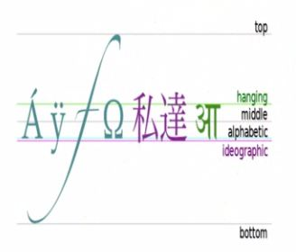
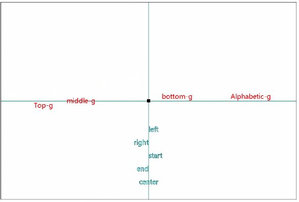

## canvas
#### 应用领域
- **可视化数据**
- **banner广告**
- 游戏
- 图形编辑器
- =>模拟器
- =>远程计算机控制
- **完整的canvas移动化应用**
#### canvas语法
###### 标签
- 用标签属性或js设置画布大小，不要用CSS设置
	* `canvas.width = 600; canvas.height = 600`
- 兼容性：IE9+
###### canvas上下文 `var ctx=canvas.getContext("2d")`
- `canvas`为html中的canvas标签对象
- `webgl` 3D参数
###### API
- 线
	+ `ctx.moveTo(x,y)`
	+ `ctx.lineTo(x,y)`
	+ `ctx.closePath()` 闭合 
- 矩形
	+ `ctx.rect(x1,y1,x2,y2)`
	+ 快速创建
		* `ctx.strokeRect(x,y,width,height)`
		* `ctx.fillRect(x,y,w,h)`
- 圆
	+ ctx.arc(x,y,r,starRadian,endRadian,counterclockwise)
		* `ctx.arc(0,0,100,0*Math.PI/180,60*Math.PI/180,true)`逆时针0-60度
	+ **圆上点的坐标** *公式-1*
		+ `x=x0+Math.cos(rad)*R`
		+ `y=y0+Math.sin(rad)*R`
- 文字
	+ `ctx.font="20px '微软雅黑'"`
	+ `ctx.fillStyle="red"`
	+ 对齐方式
		* `ctx.textAlign="left"`
		* `ctx.textBaseline="top"`
	+ `ctx.strokeText("text",x,y)`
	+ `ctx.fillText("text",x,y)`
	+ `ctx.measureText("text")` 测量文本宽度
	
	
- 图片
	+ `ctx.drawImage(img,x,y[,w,h])`
		* 参数说明：
		* `img`图片DOM对象;
		* `w` 
		* `h`
	+ `ctx.drawImage(img,sx,sy,sWidth,sHeight,x,y,width,height)`
		* `sx,sy` 源图片显示部分左上坐标
		* `sWidth,sHeight` 源图片显示宽高
		* `x,y` 绘制画布坐标
		* `width,height` 绘制在画布上的图片宽高
- 橡皮擦
	+ `clearRect(x,y,w,h)`
	+ *重新设置画布的宽高可以清空画布所有内容*
- 通用
	+ `ctx.beginPath()` 开启一个新状态
		* 绘制不同样式的形状前需要加
	+ `ctx.lineWidth = 4`
	+ `ctx.strokeStyle = "rgba(255,255,0,.8)"` 描边颜色
	+ `ctx.stroke()` 描边
	+ `ctx.fillStyle = "blue"`
	+ `ctx.fill()` 填充,默认黑色
		* *非零环绕规则*

- 阴影
- 渐变
- 背景
- 变换
	+ `context.scale()`
	+ `ctx.translate()`
	+ `context.rotate(angle)`
- 保存和还原
	+ `ctx.save()` 保存当前环境状态
	+ `ctx.restore()` 返回之前保存过的路径状态和属性